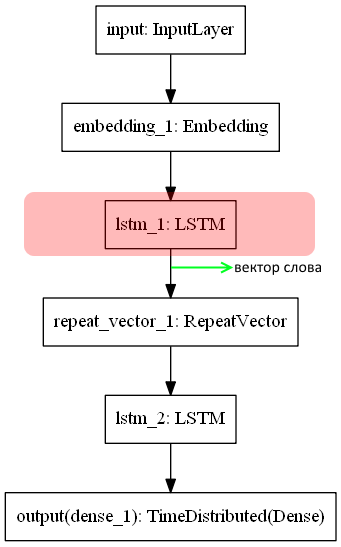
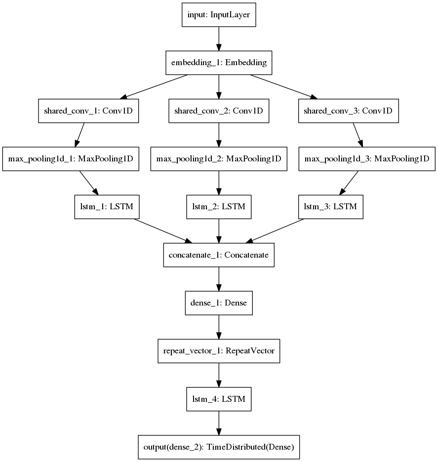
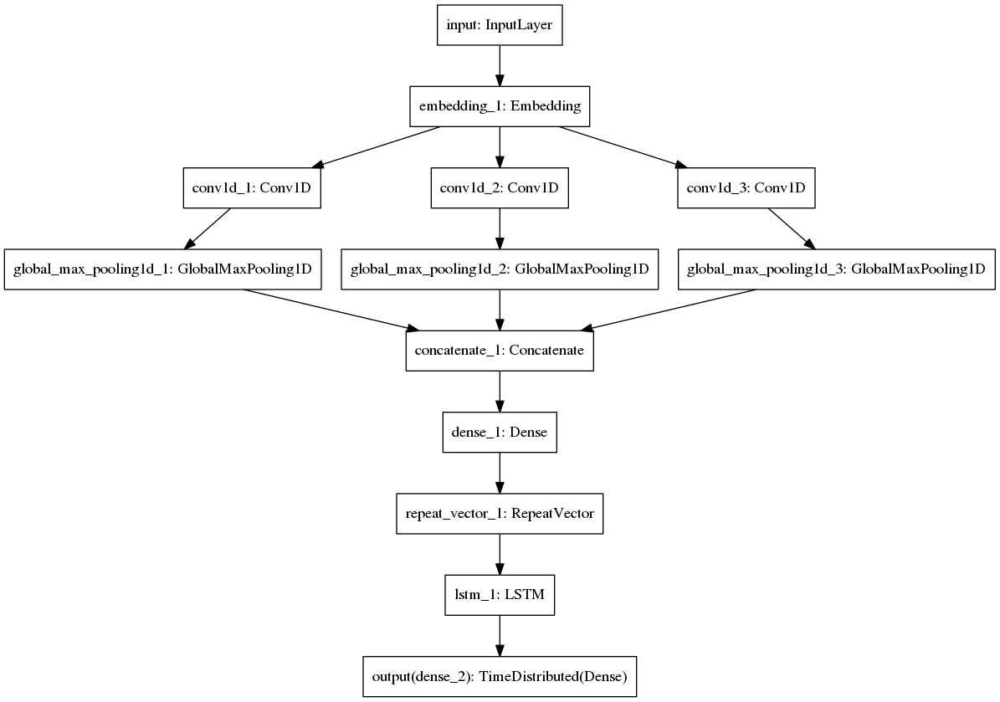
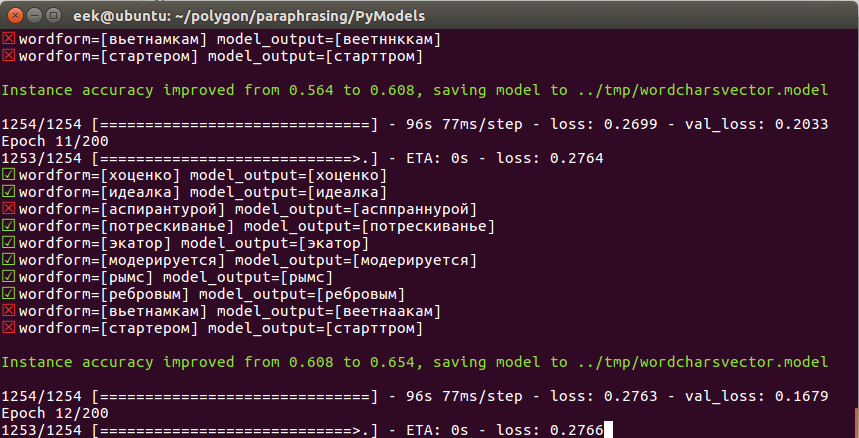

## Модель посимвольного встраивания слов в векторное пространство

Модели чат-бота при работе используют разные способы векторного представления слов.
Один из использованных алгоритмов векторизации заключается в упаковке посимвольного
представления слова в вектор действительных чисел заданной фиксированной небольшой
размерности (по умолчанию для этой модели я использую 56).

Исходный код тренера модели содержит реализацию нескольких альтернативных архитектур
нейросети, выполняющих задачу векторизации слова. Далее эти архитектуры перечисляются 
с кратким описанием.

### Выбор архитектуры нейросети

Архитектура нейросети задается опцией --arch_type при запуске программы [wordchar2vector.py](https://github.com/Koziev/chatbot/blob/master/PyModels/wordchar2vector.py).

Простой и эффективный сжимающий рекуррентный автоэнкодер на базе LSTM:
```
--arch_type rnn
```

Аналогичный вариант с bidirectional LSTM в кодирующей части сетки включается опцией:
```
--arch_type bidir_lstm
```

Только сверточные слои:
```
--arch_type cnn
```


Гибридная сетка из сверточных и рекуррентных элементов, работающих параллельно:
```
--arch_type lstm+cnn
```

Архитектура из рекуррентного слоя поверх сверточных элементов:
```
--arch_type lstm(cnn)
```

### Классический рекуррентный автоэнкодер

Цепочка символов может быть сжата в вектор с использованием двух рекуррентных слоев, основанных
на [keras.LSTM](https://keras.io/layers/recurrent/):



На вход подается цепочка символов слова. Эта цепочка упаковывается в вектор фиксированной
длины с помощью LSTM-слоя. Вектор, получаемый на выходе этого слоя содержит всю информацию
о символах, 2-граммах и т.д. в исходном слове. Это позволяет прочим моделям учитывать
как семантическую, там и морфологическую близость слов. К примеру, слова "использование"
и "использовалась" в большинстве языковых контекстов образуют близкие
по смыслу предложения благодаря общему корню:

*Земля использовалась плохо.*  
*использование земли было плохим*  

В других ситуация важную информацию несут суффиксы, окончания или приставки.
Посимвольные встраивания слов доставляют эту информацию в качестве признаков на вход
других моделей чат-бота.

Выходная часть автоэнкодера, реализованная тоже как LSTM слой, восстанавливает исходную цепочку символов слова из
вектора. Данная часть нейросети нужна только на этапе тренировки. После завершения тренировки
она отрезается.

Запуск из командной строки:
```
python wordchar2vector.py --train 1 --i ../tmp/known_words.txt --o ../tmp/wordchar2vector.dat --model_dir ../tmp --arch_type rnn --tunable_char_embeddings 0 --char_dims 0 --batch_size 250 --dims 56
```

Как видно по кривым обучения (см. ниже), данная архитектура дает хорошее качество при достаточно быстрой
сходимости.

Вместо одного слоя LSTM в кодирующей части можно использовать bidirectional LSTM, заменив
опцию -arch_type rnn на -arch_type bidir_lstm. Этот вариант дает немного лучшее качество, чем
просто LSTM слой, но обучается немного дольше.

### Рекуррентный автоэнкодер поверх сверточных слоев

Пары, тройки и прочие N-граммы символов в словах несут большую информацию, чем отдельные символы.
Корней, суффиксов, приставок и окончаний в русском языке намного больше, чем букв алфавита,
но значительно меньше, чем употребимых слов. Можно предположить, что если подняться
с уровня символов на уровень 2...4-символьных шинглов, можно упростить нейросети задачу отыскания
статистически значимых цепочек символов. Данную идею использует следующая архитектура:



Сначала исходную цепочку символов анализируют детекторы буквосочетаний, реализованные
как сверточные слой [Conv1D](https://keras.io/layers/convolutional/). Затем идут слои MaxPooling1D,
позволяющие детектировать морфемы вне зависимости от фактического положения в слове. Это позволяет
обнаруживать, например, корень '-короб-' в словах 'коробоча' и 'полкоробки' как одну фичу.
Далее, наборы выделенных морфемных фич поступают на рекуррентный слой, который упаковывает
их в вектор действительных чисел заданной длины так, что исходное слово можно достаточно
точно восстановить из этого вектора.

Недостаток этой архитектуры в сравнении с чисто рекуррентным автоэнкодером - более количество
параметров сетки, которые модель должна настроить в ходе тренировки. Поэтому обучение
идет медленнее и требует больше эпох.

Запуск из командной строки:
```
python wordchar2vector.py --train 1 --i ../tmp/known_words.txt --o ../tmp/wordchar2vector.dat --model_dir ../tmp --arch_type cnn*lstm --tunable_char_embeddings 0 --char_dims 0 --batch_size 250 --dims 56
```


### Чисто сверточная нейросетка

Этот вариант добавлен только для экспериментов. Он не позволяет достичь хорошей точности
представления слова, хотя вычислительно наименее обременителен:



Обучение запускается из командной строки так:

```
python wordchar2vector.py --train 1 --i ../tmp/known_words.txt --o ../tmp/wordchar2vector.dat --model_dir ../tmp --arch_type cnn --tunable_char_embeddings 0 --char_dims 0 --batch_size 250 --dims 56
```


### Гибридная нейросетевая модель

В этом варианте кодирующая часть нейросетки представлена сверточными и рекуррентным слоями,
работающими параллельно:


Запуск из командной строки:
```
python wordchar2vector.py --train 1 --i ../tmp/known_words.txt --o ../tmp/wordchar2vector.dat --model_dir ../tmp --arch_type lstm+cnn --tunable_char_embeddings 0 --char_dims 0 --batch_size 250 --dims 56
```


### Кривые обучения для всех архитектур

Изменение точности валидации по мере отработки эпох обучения:


В данном случае "точность" определяется как корректное восстановление исходного слова
на выходе декодера. Поэтому ошибка в восстановлении одного символа засчитывается как
ошибка модели.

Тетрадка с кодом визуализации влияния batch_size на обучения доступна по [ссылке](https://github.com/Koziev/chatbot/blob/master/PyModels/%D0%92%D0%B8%D0%B7%D1%83%D0%B0%D0%BB%D0%B8%D0%B7%D0%B0%D1%86%D0%B8%D1%8F%20%D0%B2%D0%BB%D0%B8%D1%8F%D0%BD%D0%B8%D1%8F%20batch_size%20%D0%BD%D0%B0%20%D0%BE%D0%B1%D1%83%D1%87%D0%B5%D0%BD%D0%B8%D0%B5%20wordchar2vector.ipynb).


### Основной настроечный параметр модели

Качество и сложность модели и использующих ее алгоритмов регулируется параметром "размер вектора слова",
который задается опцией --dims NN в командой строке. По умолчанию этот параметр равен 56.

### Настраиваемость векторов символов

Символы представляются векторами фиксированной длины. По умолчанию длина вектора для символов
принимается такой, чтобы вместить 1-hot представление всех используемых в корпусе символов.
Также по умолчанию эти вектора не подстраиваются по ходу обучения модели.

Чтобы явно задать другой размер векторов символов, используйте опцию --char_dims NN.
Разрешить настраиваемость векторов символов можно опцией --tunable_char_embeddings 1.

В коде настраиваемость векторов символов задается как параметр trainable=True для
конструктора класса [keras.layers.Embedding](https://keras.io/layers/embeddings/).

Пример командной строки запуска обучения:

```
python wordchar2vector.py --train 1 --i ../tmp/known_words.txt --o ../tmp/wordchar2vector.dat --model_dir ../tmp --arch_type bidir_lstm --char_dims 0 --tunable_char_embeddings 1 --batch_size 250 --dims 56
```

Кривые обучения при включенном и отключенном обучении векторов символов:


### Тренировка модели wordchar2vector

Для тренировки посимвольных встраиваний необходимо выполнить два шага.

Во-первых, сгенерировать список слов. Эту задачу выполняет скрипт [prepare_wordchar_dataset.py](https://github.com/Koziev/chatbot/blob/master/PyModels/prepare_wordchar_dataset.py).
Он читает несколько других датасетов и текстовых файлов и сохраняет итоговый список
слов в файле [../tmp/known_words.txt](https://github.com/Koziev/chatbot/blob/master/tmp/known_words.txt).
Вариант этого файла выложен в репозиторий, поэтому первый шаг можно пропустить. Также можно
обучать модель на своем наборе слов, сформировав текстовый файл в кодировке utf-8, в котором
на каждой строке находится одно слово.

Во-вторых, запустить тренировку модели скриптом [wordchar2vector.py](https://github.com/Koziev/chatbot/blob/master/PyModels/wordchar2vector.py)
примерно такой командой:

```
python ../PyModels/wordchar2vector.py --train 1 --i ../tmp/known_words.txt --o ../tmp/wordchar2vector.dat --model_dir ../tmp --dims 56
```

Для запуска обучения можно взять готовый скрипт ../scripts/train_wordchar2vector.cmd или
../scripts/train_wordchar2vector.sh, в которых указаны пути к входным и выходным файлам.

Тренировка модели сопровождается наглядной визуализацией текущего состояния модели:



### Векторизация лексикона без перетренировки модели

Тренировочный скрипт сохраняет на диске саму модель (файлы с метаданными для восстановления
нейросетки и веса). Поэтому новые слова в поступающих от собеседника фразах можно
векторизовать на лету, если в готовом наборе векторов их еще нет. 

Если задать в командной строке опции --train 0 --vectorize 1, то будет загружены файлы
ранее обученной модели из каталога, указанного опцией --model_dir, и слова из входного
файла будут векторизованы и сохранены в выходном файле.

```
python ../PyModels/wordchar2vector.py --train 0 --vectorize 1 --i ../tmp/known_words.txt --o ../tmp/wordchar2vector.dat --model_dir ../tmp
```

Этот режим позволяет быстро векторизовать лексикон после добавления новых
предложений в исходные датасеты, не переучивая нейросеть.

### Где используется модель wordchar2vector

Загрузка и использование векторых моделей слов в чатботе инкапсулировано в классе [WordEmbeddings](https://github.com/Koziev/chatbot/blob/master/PyModels/bot/word_embeddings.py)
