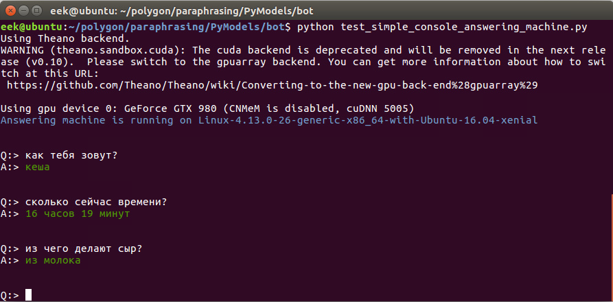
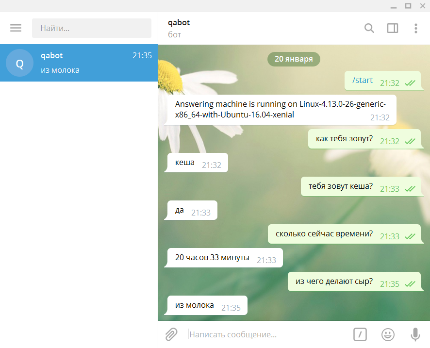

# Вопросно-ответная диалоговая система (чатбот)

## Краткое описание

Разрабатываемый набор инструментов, позволяющих организовывать диалоговые сессии
пользователя примерно такого вида:

```
B:> Привет, буду рад поговорить
H:> Как тебя зовут?
B:> кеша
B:> А как тебя зовут?
H:> Меня зовут Илья.
B:> Приятно познакомиться.
H:> Сколько будет 2 плюс 2?
B:> 4
H:> Меня как зовут?
B:> илья
H:> Сколько сейчас времени?
B:> 17 часов 47 минут
```

В этом примере реплики чатбота отмечены символами B:>, а реплики человека - символами H:>.

Основные особенности чатбота:

1) Новая информация (факты), сообщаемые пользователем, могут немедленно добавляться
в базу знаний и использоваться в последующих ответах наряду с остальными фактами. Именно так
в базу знаний бота попадает имя собеседника, которое он сообщает. Переобучение моделей
при этом не требуется.

2) Сессионность: сообщаемые пользователем факты сохраняются в отдельном разделе
базы знаний, привязанном к пользователю, так что сессии для разных пользователей
могут оперировать противоречащей или конфиденциальной информацией.

3) Ориентированность на клиент-серверный механизм; способ доставки сообщений отвязан от
ядра системы и может быть реализован в виде текстовой консоли, бота для мессенджера,
браузерного клиента для веб-сервиса и т.д.

Благодаря использованию [посимвольных встраиваний для слов](./PyModels/trainers/README.wordchar2vector.md)
чатбот можно обучить отвечать даже на такие вопросы:

```
B:> Привет, буду рад пообщаться
H:> сколько букв в слове мама?
B:> 4
```

В более широком смысле посимвольные встраивания для слов позволяют боту лучше учитывать
некоторые лексические особенности русского языка, в частности - однокоренные слова.

## Консольный фронтенд для бота

Реализован в файле [console_chatbot.py](https://github.com/Koziev/chatbot/blob/master/PyModels/console_chatbot.py).
Запуск под Linux выполняется скриптом scripts/console_bot.sh



## Чатбот для Telegram

Реализован в файле [test_telegram_bot.py](https://github.com/Koziev/chatbot/blob/master/PyModels/bot/test_telegram_bot.py)



## Технические подробности реализации

Описание тренировки и использования модели посимвольного встраивания слов
смотрите на [отдельной странице](./PyModels/trainers/README.wordchar2vector.md).

Также доступно [описание модели для определения релевантности факта и вопроса](README.relevance.md).
